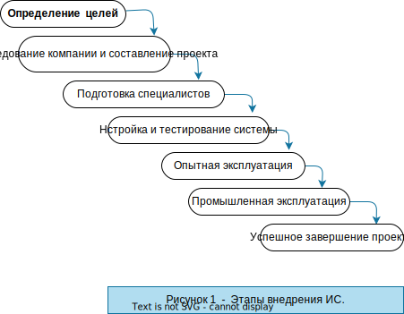

#  АНАЛИТИКА  В  МЕДИЦИНЕ

## Описание проекта

 Нещбходимо изучить базу данных по пациентам и сформировать отформатированные таблицы ежемесячной отчётности.

**Цель проекта** - применение современных инструментов аналитики, обеспечивающих высокую эффективность внедрения информационных систем (ИС) в деятельность учреждения.   

 > В качестве исходных данных взяты журналы отчётов различных отделений больницы.
  Актуальность работы обусловлена необходимостью автоматизации деятельности и внедрения новых ИС.

  ## Введение

      Эффективное управление любым учреждением невозможно без внедрения новых ИС, которые обеспечивают оперативной информацией для принятия своевременных и правильных управленческих решений.   
      Успех внедрения ИТ зависит не только от методологии внедрения, но и от используемых инструментов аналитики.

      Реализация данного проекта представвляет как актуальность, так и практический интерес.   
      Объектом исследования работы является проект внедрения информационной системы в деятельность учреждения.
      Цель выпускной квалификационной работы - применение совеременных инструментов аналитики, которые помогут обеспечить высокую эффективность внедрения ИС в деятельность учреждения.   
      Для достижения данной цели надо выполнить следующие задачи :   
      - произвести обзор и анализ внедрения ИС в деятельность учреждения;   
      - выполнить реализацию предлагаемых проектных решений на конкретном примере;   
      - оценить эффективность предлагаемых проектных решений.  

      Практическая значимость работы заключается в разработке проекта использования инструментов аналитики для внедренияя ИС, обеспечивающей повышение эффективности управления деятельностью учреждения и в конечном итоге - обеспечивающей более качественное оказание медицинских услуг населению.

## Глава I. Обзор и анализ методологий внедрения информационных систем в деятельность организации.   

### 1.1 Характеристики проекта внедрения информационной системы в деятельность организации.   
 Внедрение информационной системы – это сложный процесс интеграции программного продукта в финансово-управленческую деятельность компании, требующий от специалистов, участвующих в проекте,
наличия специальных знаний, соответствующего опыта и особого подхода к реализации проекта.
Классическое представление последовательности этапов внедрения
информационной системы (ИС) показано на рисунке 1 .

Цель проекта ИС - предоставление руководству информации для анализа её текущего состояния и принятия решений по изменениям.   
    Задача проекта  внедрения ИС включает в себя адаптацию и запуск в проуктивную эксплуатацию технологических и управленческих элементов ИС.    
О сложности этой задачи свидетельствует известная из результатов
исследований Standish Group неутешительная статистика по успешности
проектов внедрения в конце 90-х годов прошлого века, согласно которой
только 26% проектов завершились в срок и обеспечили реализацию заданной
функциональности, не превысив при этом выделенный бюджет.
Одним из способов упрощения решения данной задачи является
применение современной методологии внедрения ИС.

### 1.2 Анализ подходов и выбор методологии внедрения ИС.

Методология внедрения строится как пересечение двух различных
областей знаний: специфической технологии создания ИС и достаточно
универсальной технологии управления проектной деятельностью (рисунок 2).

  

    